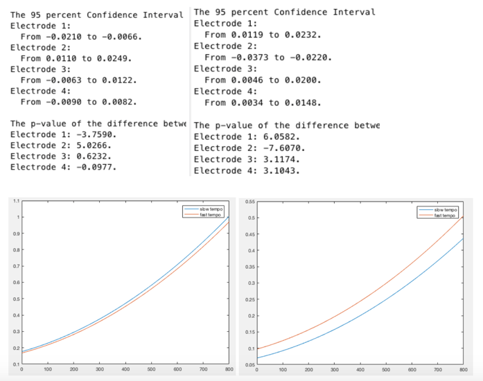

# MusicTempoAndBrainwave
Presentation video: https://drive.google.com/file/d/0B2fshroYB_ifZElsM3lCZUYzemM/view

## Effects of Music Tempo on Beta Brainwave
### I. Abstract 
In this MATLAB project, we decided to discover the effects of music tempo on one kind of brainwave, beta brainwave. According to an academic study we found online 1(see reference at the end) there will be a change in beta brainwave when music tempo is altered: “Beta wave amplitude increased significantly as the tempo increased”. Thus, we decided to find out if there is actually an increase in beta brainwave amplitudes when people listen to fast-tempo music versus slow-tempo music. Once we obtained the data, we adopted the concepts of Plotting, 95% Confidence Interval, P-value test and Polynomial Regression to determine if there is an increase in beta brainwave amplitudes. We then printed the results out both in word and graph format to analyze the data and come up with our conclusion. 
### II. Introduction
When we first formed our team and brainstormed our project idea, we knew we were all interested in doing something related to brainwave values. We then looked up academic sources on brainwaves and found an intriguing paper on music tempo and beta brainwave amplitudes. We thought the theory about how beta brainwave amplitudes increase when the tempo of music increases in the paper was very interesting, thus we decided to test the theory out. Thanks to our teaching assistant Xiaodong who kindly lent us some Muse headbands to collect our own brainwave amplitude values, we were able to do the experiment using our own brainwave values. Once we obtained the headbands, it became easy for us to listen to music of different tempos and compare our brainwave amplitude data to test our hypothesis. Thus, our focus of this project was to find out whether there is an increase in beta brainwave amplitudes when tempo of music increases using MATLAB functions and Muse headbands.  
### III. Background and related work
Starting from collecting data, we learned about how to collect brainwave data using the Muse developer tools. All the brainwave data values are recorded 10 times per second from 4 electrodes, thus when we turn the Muse recordings into text files, we have a text file consisting of about 2000 rows and 21 columns of values: the first column being timestamp, and the next 4 being alpha wave values from 4 electrodes, the next 4 being beta waves and so on.  Since we learned how to process matrixes using matrix operation, then we converted our brainwave data into matrixes in MATLAB. In the academic study we found online, the beta brainwave data shows a difference when people listen to fast and slow tempo music. To be specific, the beta wave data is generally higher when people are listening to fast-tempo music than listening to slow tempo music. We initially collect brainwave data when the all of us were listening to slow and fast tempo classical music and it turns out that there is no significant difference between the beta wave data, then we made a hypothesis that the genre of music may also affects beta brain wave. Then we did another experiment and collected the data when we were listening to fast and slow tempo jazz music. This time, generally an increase of beta wave data appears which proved our hypothesis. The result of our experiment partly supports the theory of the paper because the increase of beta brain wave only appears when people are listening to different tempos of jazz music.
### IV. Problem formulation
The problem we have is that we want to figure out a way to manage the data we have to reach a conclusion to prove our hypothesis. Generated from the reference paper, our initial hypothesis was the beta brain wave will increase when the tempo of music increases. The problem we need to solve is to extract the data, store the data into MATLAB and compute the data.  First of all, we needed to convert the muse file to a test file and then load the data into MATLAB as a matrix; then we extract the data we need to form several new matrixes, we generally have data with 2100 rows and 21 columns because the muse headband collect the data every 0.1 second and our experiment last for 210 seconds; since we only want the data of beta brain waves, we figured out that the first column of data represents the timestamp; from 2-5 columns, the data represents alpha brain wave data from four electrodes; and what we need is from 6-9 columns. Thus, we store the beta brain wave data into matrixes. Since we want to compare two sets of brainwave data and show that the two sets of data have significant difference, we used mathematical methods such as calculating sum and average; we also used curve fitting and tried to find a polynomial to fit the data. Finally, we used complex statistic functions such as 95% confidence interval and p-value test to prove our hypothesis.
### V. Solution Methodology
For finding the relationship between beta brainwaves and different tempo music (from classical and jazz), we used three different functions. The problem is that we want to support or refute our hypotheses, where there is a correlation between fast tempos and increase in beta waves. In order to do so we used different statistical methods to determine if that correlation was there or not. One was looking at the 95% confidence interval, another was the p-value, and the last was creating our own polyfit function. 
Given a normal distribution (a bell-curve) we can find an interval, a range of values, that the population mean can fall under based on a sample data set. In this case, beta wave data from one electrode is collected for two different tempo songs (one file split into two parts) to make up the sample set. The 95% confidence interval function provides us a range that 95% of the population mean would fall under. What we are looking at is the difference between the wave size for fast tempo and slow tempo songs. If the range returned contains the number 0, that means that the population mean may be 0, signifying that there is no difference between the beta wave results from fast tempo music, and the results from slow tempo music. If it doesn’t, then that proves that there is a relationship between the tempo and the size of the beta brain wave. A p-value helps us determine the significance of our results when testing our hypotheses. Just like a 95% confidence, we want to determine p<0.05 to reject our null hypothesis. Using our created function, what we end up finding is the z-score. For determining if p<0.05, the corresponding z-score is 1.64. If the value is less than 1.64, then we cannot reject our null hypothesis. If it is above, then we can reject our null hypothesis, which will support our alternative one. This way, we can find with confidence if there is a significant correlation between fast tempo music and higher beta brain waves.  
We created our own function, polyfit2, which functions in the same way that the built-in polyfit function in MATLAB does. Using the formula that is mentioned in the resources section, we coded the mathematical steps needed to be taken to create a function that allows us to find the polynomial that best fits a set of data using least squares regression. What we used this for is to compare the best fit polynomial of a set of data points from listening to a fast tempo song and comparing it to the best fit polynomial of a slow tempo song from the same genre listened by the same subject. These polynomials are plotted on the same graph which lets us compare the two. This lets us easily see the relationship between beta brainwaves from listening to slow and fast tempo songs, and see which caused more of a rise in beta waves. Splitting a data file into two parts, fast and slow tempo, the function creates a graph for each electrode’s data collected from the muse headband. So, for both fast and slow tempo, the data collected on beta brainwaves from the same electrode are plotted on the same graph. If the line plotted for the fast tempo is higher than the line for slow tempo music, that means there is a correlation between faster tempo music and increase in beta waves. 
### VI. Results
Attached are examples of results from the running of the functions. In order to run the program, put all functions and text files in the same folder and run the file called project.m. Results for Anirudh’s Classical Data and Jazz data are posted below, with first electrode from the polyfit2 function results only. What we found is that a correlation between the tempo of classical music and the size of beta waves is not apparent, but for Jazz music, the data supports that there is a positive correlation between the tempo of a song and the beta brain wave level.

On the left side are the results from the three main functions using Anirudh’s classical data. The right side is for Anirudh’s Jazz results. As can be seen, the left side does not consistently meet the requirements needed for us to prove our hypothesis. Two electrodes contain 0 in its range for the 95 percent confidence interval. Two electrodes are below 1.64 for the p-value function. The first electrode from the polyfit2 function shows that slow tempo music had a slightly higher effect on increase of beta brainwaves than fast tempo. These results do not support our alternative hypothesis. For the right side however, everything is consistently in favor of a positive correlation between beta brainwaves and faster tempo music. There is no 0 in any of the ranges, every value, except 1 is above 1.64, and the graph clearly shows a higher effect on beta waves when listening to fast tempo jazz music.  
### VII. Conclusions and future work
Through our results, we found that our alternative hypothesis, that there is a correlation between an increase in tempo and an increase in beta brain waves, was supported by the results of all three functions when it came to listening to Jazz music. In the case of classical music, the correlation was not as strong. Using our knowledge of statistical functions, and MATLAB concepts, such as matrix multiplication/vectorization/graphing, we were able to take the data from fast and slow tempos, and show the relationship between the collected values in relation to each other either through a range, a probability, and a graph.  Further steps that we wanted to implement is using k-means clustering to further analyze our data. Specifically, what we wanted to do is show that slow tempo music data was near one cluster (lower beta wave levels) while fast music tempo data clustered around another point, if we were to split the data into two clusters. We could have also collected other data, and using the functions we created, we could have analyzed how tempo/genre of music affected other kinds of brainwaves.
### VIII. References:
#### Original Study:
Impulse: The Premier Undergraduate Neuroscience Journal (2013)
Title: Music genre preference and tempo alter alpha and beta waves in human non-musicians.
https://impulse.appstate.edu/sites/impulse.appstate.edu/files/Hurless%20et%20al.%20_0.pdf
#### 95% Confidence Interval method:
http://sphweb.bumc.bu.edu/otlt/mphmodules/bs/bs704_confidence_intervals/BS704_Confidence_Intervals6.html
#### P-value method:
https://onlinecourses.science.psu.edu/statprogram/node/138
#### Polynomial through least square regression:  
http://www.maplesoft.com/applications/view.aspx?SID=4845&view=html
#### Slow Jazz:
Duke Ellington & John Coltrane - The Feeling of Jazz (0:10 – 1:40)
https://www.youtube.com/watch?v=iA8lgca-3RM
#### Fast Jazz:
Giant Steps, John Coltrane (0:30 – 2:00)
https://www.youtube.com/watch?v=iA8lgca-3RM
#### Slow Classical: 
Moonlight Sonata 1st mov. (0:00 – 1:30)
https://www.youtube.com/watch?v=D3t5ScDjyL8
#### Fast Classical:
Rossini: William Tell Overture: Final (0:30 – 2:00)
https://www.youtube.com/watch?v=c7O91GDWGPU
